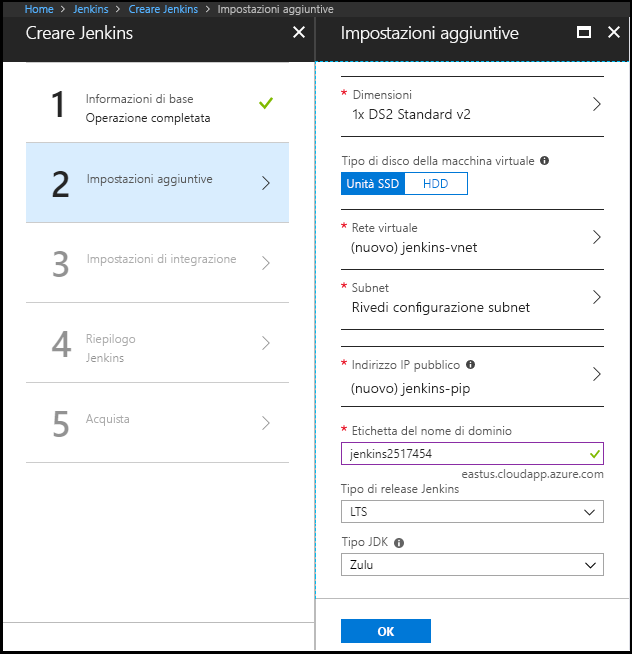

1. Nel browser aprire l'[immagine di Azure Marketplace per Jenkins](https://azuremarketplace.microsoft.com/marketplace/apps/azure-oss.jenkins?tab=Overview).

1. Selezionare **SCARICA ADESSO**.

    

1. Dopo aver esaminato le informazioni sui prezzi e sulle condizioni, selezionare **Continua**.

    

1. Selezionare **Crea** per configurare il server Jenkins nel portale di Azure. 

    

1. Nella scheda **Informazioni di base** specificare i valori seguenti:

    - **Name** (Nome) - Immettere `Jenkins`.
    - **Nome utente** - Immettere il nome utente da usare per l'accesso alla macchina virtuale su cui è in esecuzione Jenkins. Il nome utente deve soddisfare [specifici requisiti](/azure/virtual-machines/linux/faq#what-are-the-username-requirements-when-creating-a-vm).
    - **Tipo di autenticazione** - Selezionare **Chiave pubblica SSH**.
    - **Chiave pubblica SSH** - Copiare e incollare una chiave pubblica RSA nel formato a riga singola (che inizia con `ssh-rsa`) o nel formato PEM su più righe. È possibile generare le chiavi SSH tramite ssh-keygen in Linux e macOS o con PuTTYGen in Windows. Per altre informazioni sulle chiavi SSH e Azure, vedere l'articolo [Come usare le chiavi SSH con Windows in Azure](/azure/virtual-machines/linux/ssh-from-windows).
    - **Sottoscrizione**: selezionare la sottoscrizione di Azure in cui si vuole installare Jenkins.
    - **Gruppo di risorse**: selezionare **Crea nuovo** e immettere un nome per il gruppo di risorse che funga da contenitore logico per la raccolta di risorse che costituiscono l'installazione di Jenkins.
    - **Località**: selezionare **Stati Uniti orientali**.

    

1. Selezionare **OK** per passare alla scheda **Impostazioni aggiuntive**. 

1. Nella scheda **Impostazioni aggiuntive** specificare i valori seguenti:

    - **Dimensioni**: selezionare l'opzione appropriata per le dimensioni per la macchina virtuale Jenkins.
    - **Tipo di disco della macchina virtuale**: specificare HDD (unità disco rigido) o SSD (unità SSD) per indicare il tipo di disco di archiviazione consentito per la macchina virtuale Jenkins.
    - **Rete virtuale** - (Facoltativo) Selezionare **Rete virtuale** per modificare le impostazioni predefinite.
    - **Subnet** - Selezionare **Subnet**, verificare le informazioni e selezionare **OK**.
    - **Indirizzo IP pubblico**: per impostazione predefinita, per il nome dell'indirizzo IP viene usato il nome di Jenkins specificato nella pagina precedente, preceduto dal suffisso -IP. È possibile selezionare l'opzione per modificare il valore predefinito.
    - **Etichetta del nome di dominio**: specificare il valore per l'URL completo della macchina virtuale Jenkins.
    - **Tipo di versione Jenkins** - Selezionare il tipo di versione desiderato tra le opzioni `LTS`, `Weekly build` o `Azure Verified`. Le opzioni `LTS` e `Weekly build` sono descritte nell'articolo [Jenkins LTS Release Line](https://jenkins.io/download/lts/) (Ciclo di rilascio LTS Jenkins). L'opzione `Azure Verified` fa riferimento a una [versione LTS di Jenkins](https://jenkins.io/download/lts/) verificata per l'esecuzione in Azure. 

    

1. Selezionare **OK** per passare alla scheda **Impostazioni di integrazione**.

1. Nella scheda **Impostazioni di integrazione** specificare i valori seguenti:

    - **Entità servizio** - L'entità servizio viene aggiunta in Jenkins come credenziale per l'autenticazione con Azure. `Auto` significa che l'entità verrà creata dall'identità del servizio gestito. `Manual` significa che l'entità deve essere creata dall'utente. 
        - **ID applicazione** e **Segreto** - Se si seleziona l'opzione `Manual` per l'opzione **Entità servizio** è necessario specificare `Application ID` e `Secret` per l'entità servizio. Quando si [crea un'entità servizio](/cli/azure/create-an-azure-service-principal-azure-cli), si noti che il ruolo predefinito è **Collaboratore**, sufficiente per l'utilizzo delle risorse di Azure.
    - **Enable Cloud Agents** (Abilita agenti cloud) - Specificare il modello di cloud predefinito per gli agenti in cui `ACI` fa riferimento a Istanza di contenitore di Azure e `VM` si riferisce alle macchine virtuali. È anche possibile specificare `No` se non si desidera abilitare un agente cloud.

1. Selezionare **OK** per passare alla scheda **Riepilogo**.

1. Quando viene visualizzata la scheda **Riepilogo**, vengono convalidate le informazioni immesse. Quando viene visualizzato il messaggio **Convalida superata** nella parte superiore della scheda, selezionare **OK**. 

    

1. Quando viene visualizzata la scheda **Crea**, selezionare **Crea** per creare la macchina virtuale Jenkins. Quando il server è pronto, viene visualizzata una notifica nel portale di Azure.

    