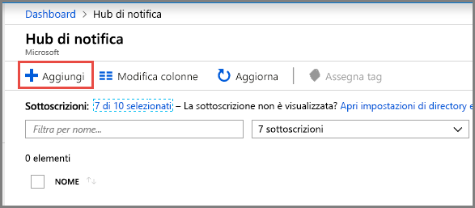

1. Accedere al [portale di Azure](https://portal.azure.com).
2. Scegliere **Tutti i servizi** dal menu a sinistra e selezionare **Hub di notifica** nella sezione **Dispositivi mobili**. Selezionare l'asterisco (`*`) accanto al nome del servizio per aggiungerlo alla sezione **PREFERITI** nel menu a sinistra. Dopo aver aggiunto l'opzione **Hub di notifica** a **PREFERITI**, selezionarla nel menu a sinistra. 

      
3. Nella pagina **Hub di notifica** selezionare **Aggiungi** sulla barra degli strumenti. 

      
4. Nella pagina **Hub di notifica** procedere come segue: 
    1. Specificare un **nome** per l'**hub** di notifica.  
    2. Specificare un **nome** per lo **spazio dei nomi**. Uno spazio dei nomi contiene uno o più hub. 
    3. Selezionare la **posizione** in cui creare l'hub di notifica. 
    4. Selezionare un gruppo di risorse esistente oppure immettere un nome per il nuovo **gruppo di risorse**.
    5. Selezionare **Create**. 

        
4. Selezionare **Notifiche** (icona a forma di campanello) e selezionare **Vai alla risorsa**. È anche possibile aggiornare l'elenco nella pagina **Hub di notifica** e selezionare l'hub di notifica. 

      
5. Selezionare **Criteri di accesso** dall'elenco. Prendere nota delle due stringhe di connessione disponibili. Sono necessarie in un secondo momento per gestire le notifiche push.

      >[!IMPORTANT]
      >**NON** usare DefaultFullSharedAccessSignature nell'applicazione. Deve essere usato solo nel back-end.
      >

      
