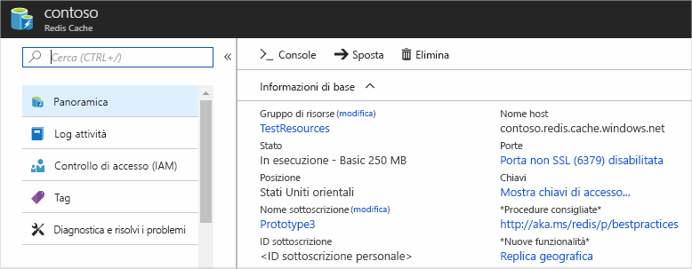

1. Per creare una cache, accedere al [portale di Azure](https://portal.azure.com). Selezionare quindi **Crea una risorsa** > **Database** > **Azure Cache for Redis** (Cache Redis di Azure).

    

2. In **New Azure Cache for Redis** (Nuova cache Redis di Azure) configurare le impostazioni per la nuova cache.

    | Impostazione      | Valore consigliato  | DESCRIZIONE |
    | ------------ |  ------- | -------------------------------------------------- |
    | **Nome DNS** | Nome globalmente univoco | Nome della cache. Deve essere una stringa contenente da 1 a 63 caratteri che possono includere solo numeri, lettere e il carattere `-`. Il nome della cache non può iniziare o terminare con il carattere `-` e i caratteri `-` consecutivi non sono validi.  | 
    | **Sottoscrizione** | Sottoscrizione in uso | Sottoscrizione in cui viene creata questa nuova istanza di Cache Redis di Azure. | 
    | **Gruppo di risorse** |  *TestResources* | Nome del nuovo gruppo di risorse in cui creare la cache. Inserendo tutte le risorse per un'app in un gruppo è possibile gestirle insieme. Ad esempio, eliminando il gruppo di risorse si eliminano tutte le risorse associate all'app. | 
    | **Posizione** | Stati Uniti orientali | Scegliere una [regione](https://azure.microsoft.com/regions/) nelle vicinanze di altri servizi che utilizzeranno la cache. |
    | **[Piano tariffario](https://azure.microsoft.com/pricing/details/cache/)** |  C0 Basic (cache da 250 MB) |  Il piano tariffario determina le dimensioni, le prestazioni e le funzionalità disponibili per la cache. Per altre informazioni, vedere la [panoramica su Cache Redis di Azure](../articles/azure-cache-for-redis/cache-overview.md). |
    | **Aggiungi al dashboard** |  Selezionato | Aggiungere la nuova cache al dashboard per renderla più semplice da trovare. |

     

3. Dopo aver configurato le impostazioni della nuova cache, selezionare **Crea**. 

    La creazione della cache può richiedere alcuni minuti. Per verificare lo stato è possibile monitorare l'avanzamento nel dashboard. Dopo la creazione, lo stato della cache sarà **In esecuzione** e sarà possibile usarla subito.

    

