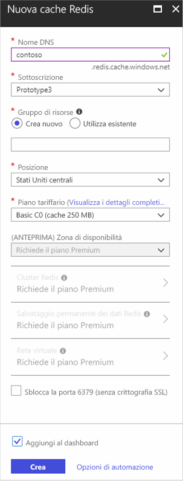

Per creare una cache, accedere al [portale di Azure](https://portal.azure.com) e fare clic su **Crea una risorsa** > **Database** > **Cache Redis**.

In **Nuova cache Redis**, configurare le impostazioni per la nuova cache.

| Impostazione      | Valore consigliato  | DESCRIZIONE |
| ------------ |  ------- | -------------------------------------------------- |
| **Nome DNS** | Nome globalmente univoco | Il nome della cache deve essere una stringa contenente da 1 a 63 caratteri che possono includere solo numeri, lettere e il carattere `-` . Il nome della cache non può iniziare o terminare con il carattere `-` e i caratteri `-` consecutivi non sono validi.  | 
| **Sottoscrizione** | Sottoscrizione in uso | Sottoscrizione in cui viene creata questa nuova cache Redis di Azure. | 
| **Gruppo di risorse** |  *TestResourceGroup* | Nome del nuovo gruppo di risorse in cui creare la cache. Inserendo tutte le risorse per un'app in un gruppo è possibile gestirle insieme. Ad esempio, eliminando il gruppo di risorse si eliminano tutte le risorse associate all'app. | 
| **Posizione** | Stati Uniti orientali | Scegliere una [regione](https://azure.microsoft.com/regions/) nelle vicinanze di altri servizi che utilizzeranno la cache. |
| **[Piano tariffario](https://azure.microsoft.com/pricing/details/cache/)** |  C0 Basic (cache da 250 MB) |  Il piano tariffario determina le dimensioni, le prestazioni e le funzionalità disponibili per la cache. Per altre informazioni, vedere [Panoramica della cache Redis di Azure](../articles/redis-cache/cache-overview.md). |
| **Aggiungi al dashboard** |  Selezionato | L'aggiunta della nuova cache al dashboard la rende più semplice da trovare. |

 

Dopo aver configurato le impostazioni della nuova cache, fare clic su **Crea**. 

La creazione della cache può richiedere alcuni minuti. Per verificare lo stato è possibile monitorare l'avanzamento nel dashboard. Lo stato della cache dopo la creazione sarà **In esecuzione** e sarà possibile usarla subito.

