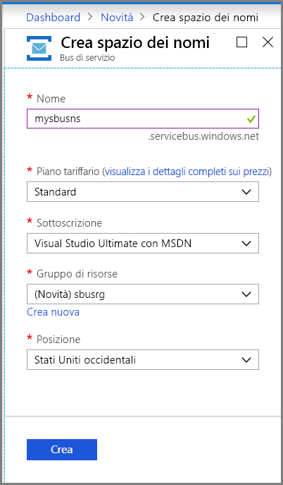
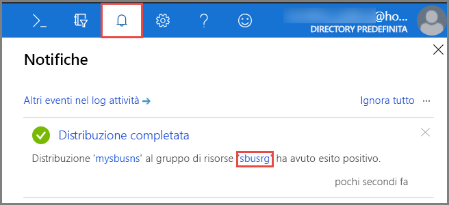
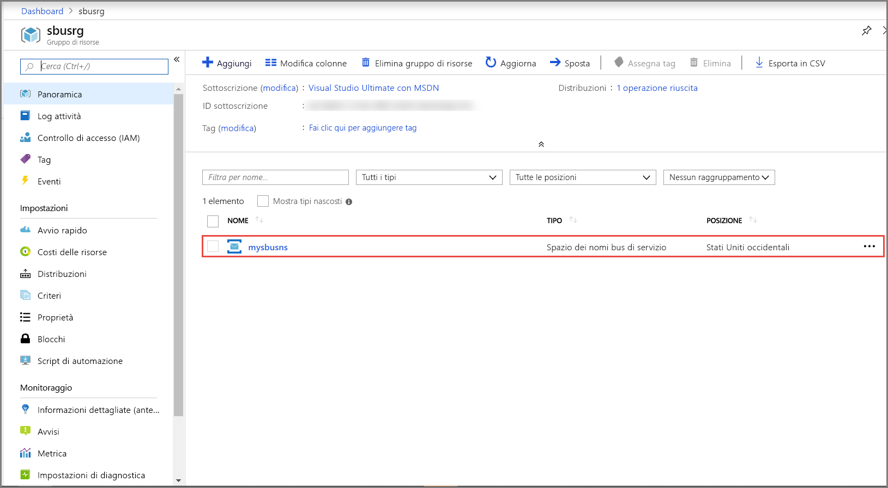
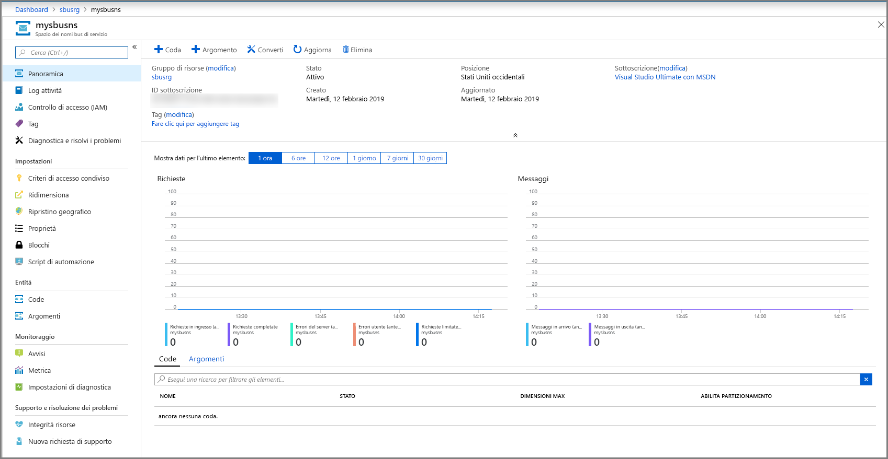
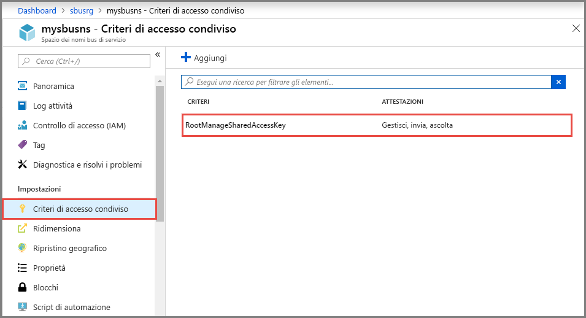
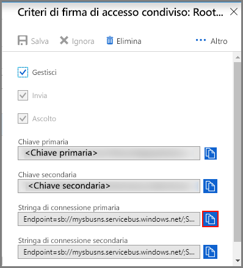

## Creare uno spazio dei nomi nel portale di Azure
Per iniziare a usare le entità di messaggistica del bus di servizio in Azure, prima di tutto è necessario creare uno spazio dei nomi con un nome univoco in Azure. Uno spazio dei nomi fornisce un contenitore di ambito per fare riferimento alle risorse del bus di servizio all'interno dell'applicazione.

Per creare uno spazio dei nomi:

1. Accedere al [portale di Azure](https://portal.azure.com)
2. Nel riquadro di spostamento sinistro del portale fare clic su **+ Crea una risorsa**, selezionare **Integrazione** e quindi **Bus di servizio**.

    
3. Nella finestra di dialogo **Crea spazio dei nomi** eseguire questa procedura: 
    1. Immettere un **nome per lo spazio dei nomi**. Verrà effettuato immediatamente un controllo sulla disponibilità del nome. Per un elenco di regole per la denominazione degli spazi dei nomi, vedere [API REST di creazione Namespace](/rest/api/servicebus/create-namespace).
    2. Selezionare il piano tariffario (Basic, Standard o Premium) per lo spazio dei nomi. Se si vogliono usare [argomenti e sottoscrizioni](../articles/service-bus-messaging/service-bus-queues-topics-subscriptions.md#topics-and-subscriptions), scegliere Standard o Premium. Argomenti e sottoscrizioni non sono supportati nel piano tariffario Basic.
    3. Se si seleziona il piano tariffario **Premium**, procedere come segue: 
        1. Specificare il numero di **unità di messaggistica**. Il piano Premium fornisce l'isolamento delle risorse a livello di CPU e memoria in modo che ogni carico di lavoro venga eseguito in isolamento. Questo contenitore di risorse viene chiamato unità di messaggistica. Uno spazio dei nomi Premium ha almeno un'unità di messaggistica. È possibile acquistare 1, 2 o 4 unità di messaggistica per ogni spazio dei nomi Premium del bus di servizio. Per altre informazioni, vedere [Messaggistica Premium del bus di servizio](../articles/service-bus-messaging/service-bus-premium-messaging.md).
        2. Specificare se impostare lo spazio dei nomi **con ridondanza della zona**. La ridondanza della zona fornisce maggiore disponibilità tramite la distribuzione delle repliche tra più zone di disponibilità all'interno di un'area senza costi aggiuntivi. Per altre informazioni, vedere [Zone di disponibilità di Azure](../articles/availability-zones/az-overview.md).
    4. Per **Sottoscrizione** scegliere una sottoscrizione di Azure in cui creare lo spazio dei nomi.
    5. Per **Gruppo di risorse** scegliere un gruppo di risorse esistente in cui risiederà lo spazio dei nomi oppure crearne uno nuovo.      
    6. Per **Località**scegliere l'area in cui deve essere ospitato lo spazio dei nomi.
    7. Selezionare **Create**. A questo punto, lo spazio dei nomi verrà creato e abilitato nel sistema. Potrebbero essere necessari alcuni minuti per consentire al sistema di effettuare il provisioning delle risorse per lo spazio dei nomi creato.
   
        
4. Verificare se lo spazio dei nomi del bus di servizio è stato distribuito correttamente. Per vedere le notifiche, selezionare l'**icona del campanello (Avvisi)** sulla barra degli strumenti. Selezionare il **nome del gruppo di risorse** nella notifica, come illustrato nell'immagine. Viene visualizzato il gruppo di risorse che contiene lo spazio dei nomi del bus di servizio.

    
5. Nella pagina **Gruppo di risorse** relativa al gruppo di risorse selezionare lo **spazio dei nomi del bus di servizio**. 

    
6. Viene visualizzata la home page dello spazio dei nomi del bus di servizio. 

    

## Ottenere la stringa di connessione 
Con la creazione di un nuovo spazio dei nomi viene generata automaticamente una regola di firma di accesso condiviso iniziale con una coppia associata di chiavi primaria e secondaria, ognuna delle quali concede il controllo completo su tutti gli aspetti dello spazio dei nomi. Per informazioni su come creare regole con diritti più limitati per mittenti e ricevitori, vedere [Autenticazione e autorizzazione del bus di servizio](../articles/service-bus-messaging/service-bus-authentication-and-authorization.md). Per copiare le chiavi primaria e secondaria per lo spazio dei nomi, procedere come segue: 

1. Fare clic su **Tutte le risorse**, quindi sul nome dello spazio dei nomi appena creato.
2. Nella finestra dello spazio dei nomi fare clic su **Criteri di accesso condiviso**.
3. Nella schermata **Criteri di accesso condiviso** fare clic su **RootManageSharedAccessKey**.
   
    
4. Nella finestra **Criteri: RootManageSharedAccessKey** fare clic sul pulsante Copia accanto a **Stringa di connessione primaria** per copiare la stringa di connessione negli Appunti e usarla in un secondo momento. Incollare questo valore nel Blocco note o in un'altra posizione temporanea.
   
    
5. Ripetere il passaggio precedente e copiare e incollare il valore della **chiave primaria** in un percorso temporaneo per usarlo in seguito.

<!--Image references-->

