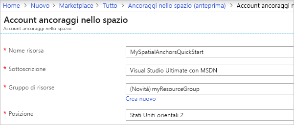
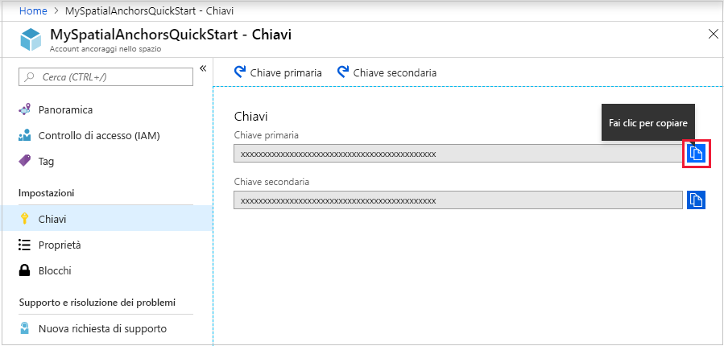

## Creare una risorsa di Ancoraggi nello spazio

1. Passare al <a href="https://portal.azure.com" target="_blank">portale di Azure</a>.

2. Nel menu sinistro del portale di Azure selezionare **Crea una risorsa**.

3. Digitare "Ancoraggi nello spazio" nella barra di ricerca.

   

4. Selezionare **Ancoraggi nello spazio (anteprima)** per aprire una finestra di dialogo e fare clic su **Crea**.

5. Nel modulo **Account ancoraggi nello spazio**:

   1. Specificare un nome di risorsa univoco.
   2. Selezionare la sottoscrizione a cui collegare la risorsa.
   3. Selezionare **Crea nuovo** per creare un gruppo di risorse a cui assegnare il nome **myResourceGroup**, quindi selezionare **OK**.
      [!INCLUDE [resource group intro text](resource-group.md)]
   4. Selezionare una località (area) in cui inserire la risorsa.
   5. Selezionare **Nuovo** per iniziare a creare la risorsa.

   

6. Dopo aver completato correttamente la creazione della risorsa, è possibile visualizzare le relative proprietà. Prendere nota del valore di **ID account** della risorsa perché sarà necessario più avanti.

   

7. In **Impostazioni** selezionare **Chiave** e prendere nota del valore di **Chiave primaria**. Questo valore è `Account Key` e verrà usato più avanti.

   
