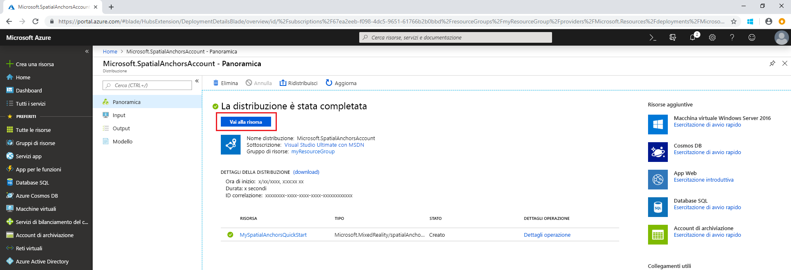
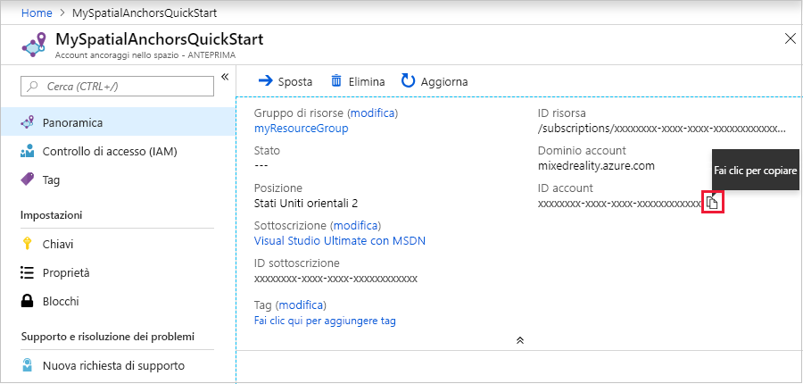

## Creare una risorsa di Ancoraggi nello spazio

Accedere al <a href="https://portal.azure.com" target="_blank">portale di Azure</a>.

Nel riquadro di spostamento sinistro del portale di Azure fare clic su **Crea una risorsa**.

Digitare **Ancoraggi nello spazio** nella casella di ricerca.

   

Selezionare **Ancoraggi nello spazio**. Nella finestra di dialogo selezionare **Crea**.

Nella finestra di dialogo **Account ancoraggi nello spazio**:

- Immettere un nome risorsa univoco, usando caratteri alfanumerici regolari.
- Selezionare la sottoscrizione a cui collegare la risorsa.
- Creare un gruppo di risorse selezionando **Crea nuovo**. Assegnare al gruppo il nome **myResourceGroup** e selezionare **OK**.
      [!INCLUDE [resource group intro text](resource-group.md)]
- Selezionare un'area in cui inserire la risorsa.
- Selezionare **Nuovo** per iniziare a creare la risorsa.

   

Dopo aver creato la risorsa, il portale di Azure indicherà che la distribuzione è stata completata. Fare clic su **Vai alla risorsa**.

Sarà possibile quindi visualizzare le proprietà della risorsa. Copiare il valore dell'**ID account** della risorsa in un editor di testo perché sarà necessario in seguito.

   

In **Impostazioni** selezionare **Chiave**. Copiare il valore di **Chiave primaria** in un editor di testo. Questo valore è `Account Key`. Sarà necessario più avanti.

   
