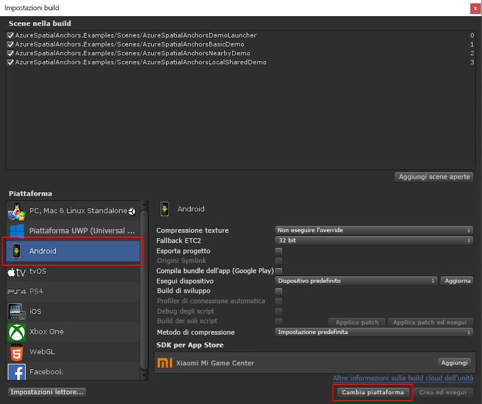

Aprire **Build Settings** (Impostazioni compilazione) selezionando **File** > **Build Settings** (File -> Impostazioni compilazione).

Nella sezione **Platform** (Piattaforma) selezionare **Android**. Impostare **Build System** (Sistema di compilazione) su **Gradle** e selezionare l'opzione **Export Project** (Esporta progetto).

Selezionare **Switch Platform** (Cambia piattaforma) per impostare **Android** come piattaforma. Unity potrebbe chiedere di installare i componenti di supporto di Android se sono mancanti.

Chiudere la finestra **Build Settings** (Impostazioni compilazione).

### Scaricare e importare ARCore SDK per Unity

Scaricare il file `unitypackage` dalle [versioni di ARCore SDK per Unity 1.5](https://github.com/google-ar/arcore-unity-sdk/releases/tag/v1.5.0). Tornare nel progetto Unity, selezionare **Assets** > **Import Package** > **Custom Package** (Asset > Importa pacchetto > Pacchetto personalizzato) e quindi selezionare il file `unitypackage` scaricato in precedenza. Nella finestra di dialogo **Import Unity Package** (Importa pacchetto Unity) assicurarsi che siano selezionati tutti i file e quindi scegliere **Import** (Importa).
