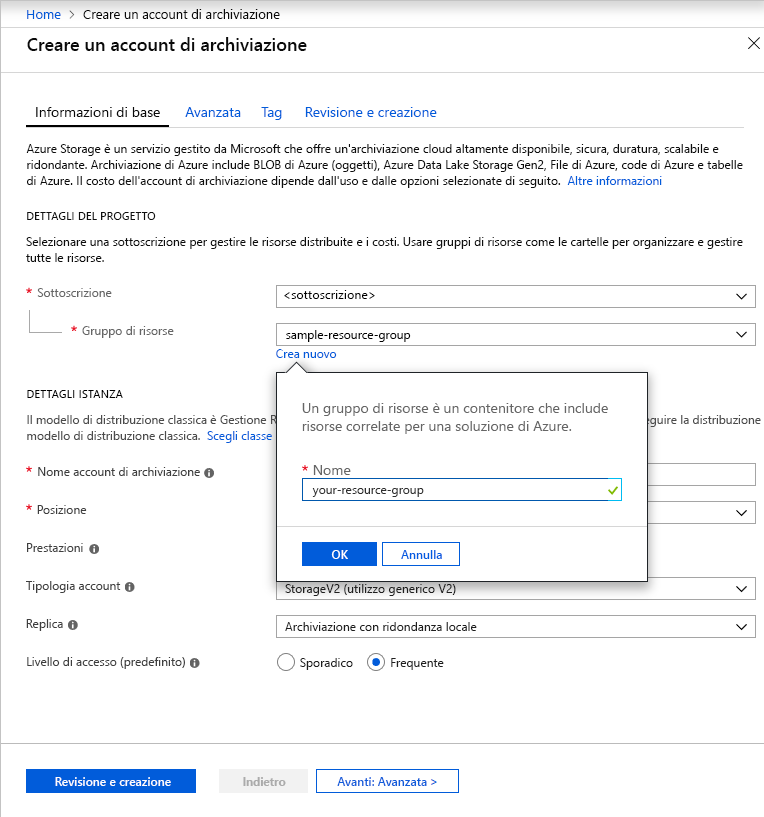

Per creare un account di archiviazione per utilizzo generico v2 nel portale di Azure, eseguire questa procedura:

1. Nel portale di Azure espandere il menu a sinistra per aprire il menu dei servizi e scegliere **Tutti i servizi**. Scorrere quindi verso il basso fino ad **Archiviazione** e scegliere **Account di archiviazione**. Nella finestra **Account di archiviazione** visualizzata scegliere **Aggiungi**.
1. Selezionare la sottoscrizione in cui creare l'account di archiviazione.
1. Nel campo **Gruppo di risorse** fare clic su **Crea nuovo**. Immettere un nome per il nuovo gruppo di risorse, come illustrato nell'immagine seguente.

    

1. Immettere quindi un nome per l'account di archiviazione. Il nome deve essere univoco in Azure, deve avere una lunghezza compresa tra 3 e 24 caratteri e può contenere solo numeri e lettere minuscole.
1. Selezionare la località per l'account di archiviazione o usare la località predefinita.
1. Mantenere i valori predefiniti per questi campi:
    - Per impostazione predefinita, il campo **Modello di distribuzione** deve essere impostato su **Gestione risorse**.
    - Per impostazione predefinita, il campo **Prestazioni** deve essere impostato su **Standard**.
    - Per impostazione predefinita, il campo **Tipologia account** deve essere impostato su **StorageV2 (utilizzo generico v2)**.
    - Per impostazione predefinita, il campo **Replica** deve essere impostato su **Archiviazione con ridondanza locale**.
    - Per impostazione predefinita, il campo **Livello di accesso** deve essere impostato su **Frequente**.

1. Fare clic su **Rivedi e crea** per esaminare le impostazioni dell'account di archiviazione e creare l'account.
1. Fare clic su **Create**(Crea).

Per altre informazioni sui tipi di account di archiviazione e su altre impostazioni dell'account di archiviazione, vedere [Panoramica dell'account di archiviazione di Azure](https://docs.microsoft.com/azure/storage/common/storage-account-overview). Per altre informazioni sui gruppi di risorse, vedere [Panoramica di Azure Resource Manager](https://docs.microsoft.com/azure/azure-resource-manager/resource-group-overview). 
